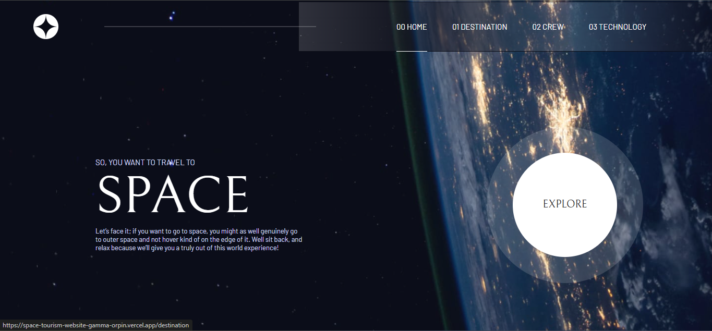
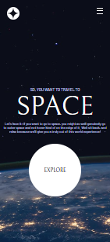

# Space Tourism website

Venha conferir o resultado no [Deploy](https://space-tourism-website-gamma-orpin.vercel.app/)

Olá, seja bem vindo(a)!

Meu intuito neste projeto foi faze-lo de uma forma em que cada componente tivesse sua função separada, fazendo com que fosse muito mais fácil de dar manutenção caso realmente fosse haver uma algum dia, na minha concepção meu objetivo foi cumprido, porque nele eu consegui implemantar algo que eu não tinha conseguido no meu portfólio, mas é o famoso ditado, "A prática leva a perfeição" ou "Só aprendemos se pratiocarmos", dito isto, agora já sei como fazer isso no meu portfólio.

Mas do que eu estou falando? Se você for olhar na pasta [Utils](./src/utils/) irá notar que criei algo parecido com um banco de dados, mas na verdade são apenas arquivos com variávei possuindo um array, o que me permitiu armazenar vários dados necessários para esse projeto, isso permitiu que eu pudesse usar muito menos linha durante o código e não precisasse repetir código. Partiu fazer isso no portfólio.

## 🛠️ Ferramentas

- TypeScript
- React ( Vite )
- React routes
- Styled components

## 🏆 Desafios

Eu acho que não teve nenhum desafio significante desta vez, já na grande maioria todas as coisas que usei neste projeto eu já havia feito pelo menos uma vez, sobre o que eu falei na descrição do projeto, não foi bem uma dificuldade, foi mais um esclarecimento, porque eu tentei fazer no portfólio usando um JSON, já aqui não foi bem assim.

## 🐛 Relatório de bugs

Se você por acaso perceber algum bug, seja funcional ou msm responsivida, sinta-se livre de fazer uma [issue](https://github.com/TCdesenvolvedorWeb/space-tourism-website/issues)